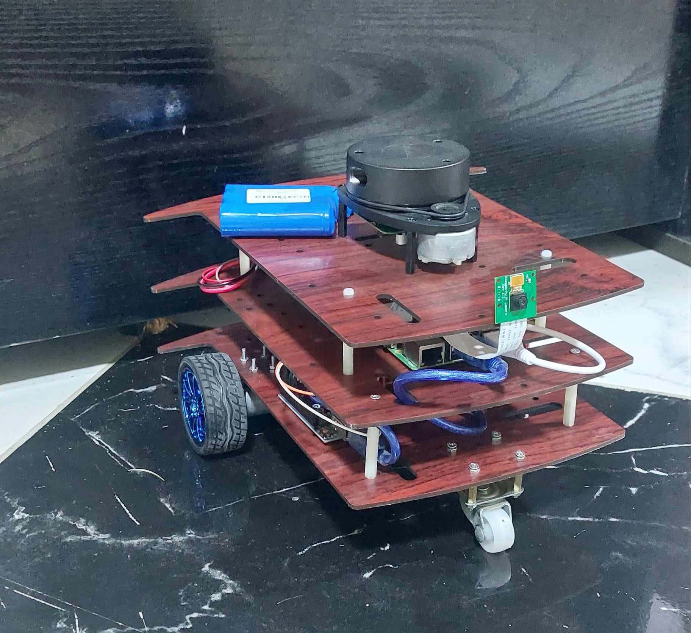

# Autonomous Navigation Mobile Robot

## Table of Contents

1. [Introduction](#introduction)
2. [Demo](#demo)
3. [Motivations](#motivations)
4. [Roadmap](#roadmap)
5. [Design](#design)
6. [Source Code](#source-code)
7. [License](#license)

## Introduction
This project is based on the Udacity Home Service Robot project; this project is the final project of the Udacity Robotics Nanodegree.

## Demo
[Robot demo](https://youtu.be/6-blbdkCTCw?si=ebP5qN-LpaIK6vIa).

## Motivations
I start working on this project for several reasons:
1. To apply the knowledge I gained from the nanodegree to a real robot.
2. To enhance my understanding of ROS (Robot Operating System).
3. To observe the robot's behavior in real-world scenarios.

## Roadmap
To complete this project, I divided it into the following steps:
1. Set up Raspberry Pi.
2. Establish an SSH connection with Raspberry Pi.
3. Run RPLidar on Raspberry Pi and visualize its data on the remote machine.
4. Implement the Arduino ROS Bridge.
5. Implement the ROS control nodes on Raspberry Pi.
6. Test control nodes using keyboard input.
7. Design and build the robot chassis.
8. Configure the mapping nodes.
9. Test the mapping.
10. Configure the navigation nodes.
11. Test autonomous navigation.
12. Enhancements and fixes.

## Design
The robot is a differential drive robot with two wheels at the back and a caster wheel at the front.
The robot's base consists of three layers made from wooden material, separated by 45mm spacers. Each layer includes various components:
1. The bottom layer contains motors, an Arduino UNO board, an L298N motor driver, and a breadboard for component interconnection.
2. The middle layer houses the Raspberry Pi 3 Model B and an XL4015 5A Step Down Module to power the Raspberry Pi.
3. The upper layer hosts the RPLidar, the Raspberry Pi Camera v1, and a 12v battery.

The robot has three sensors:
1. Motor encoders
2. RPLidar
3. Camera

    
     Home Service Robot Demo

## Source Code

The robot uses a Raspberry Pi 3B. Due to its limited processing power, I've optimized its usage by offloading visualization and heavy computing tasks to a more powerful desktop computer. I used ROS networking to establish communication between the robot and the remote computer.

The Raspberry Pi manages the robot's sensors, such as the RPLidar and camera, by publishing their data to topics. Additionally, it controls the robot's movement by sending speed commands and receiving encoder readings from an Arduino board.

On the remote computer side, I handled visualization, mapping, and localization using SLAM (Simultaneous Localization and Mapping) and navigation nodes. For SLAM, I used the slam_gmapping node, while localization is achieved through the AMCL (Adaptive Monte Carlo Localization) node. Finally, autonomous navigation to the goal location is enabled using the move_base node.

The source code of the project is divided into three parts:
1. [The robot side](/Robot-Local): This code runs on the Raspberry Pi. The Raspberry Pi runs Ubuntu 20.04 with ROS Noetic [download link](https://learn.ubiquityrobotics.com/noetic_pi_image_downloads).
2. [The remote machine side](/Remote-Machine): This code runs on a remote computer.
3. [The Arduino ROS Bridge](https://github.com/EngAhmed53/ROS-Arduino-Bridge): This Arduino code runs on the Arduino UNO board. This code acts as a bridge between ROS and the motors.

## License
This project is licensed under the [MIT License](LICENSE).
